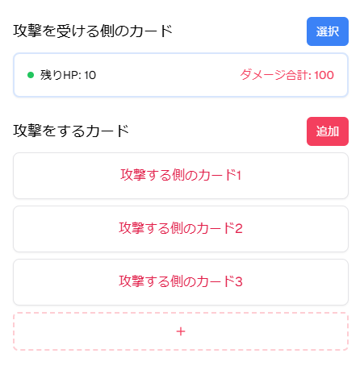

# CR Tool React

Clash Royale のバトルをシミュレーションできるウェブアプリです。
防衛ユニットに対して攻撃側のカードを組み合わせ、総ダメージと残りHPをリアルタイムで計算します。



## セットアップ

1. 依存パッケージのインストール
   ```bash
   npm install
   ```
2. 開発サーバの起動
   ```bash
   npm run dev
   ```
3. 本番ビルドの作成
   ```bash
   npm run build
   ```

## 機能

- 防衛ユニットのHP表示
- 複数の攻撃カード追加と攻撃回数の設定
- 総ダメージと残りHPのリアルタイム計算
- Chakra UI によるレスポンシブなインターフェース

## 使用技術

- [React](https://react.dev/) + [TypeScript](https://www.typescriptlang.org/)
- [Vite](https://vitejs.dev/)
- [Chakra UI](https://chakra-ui.com/)

